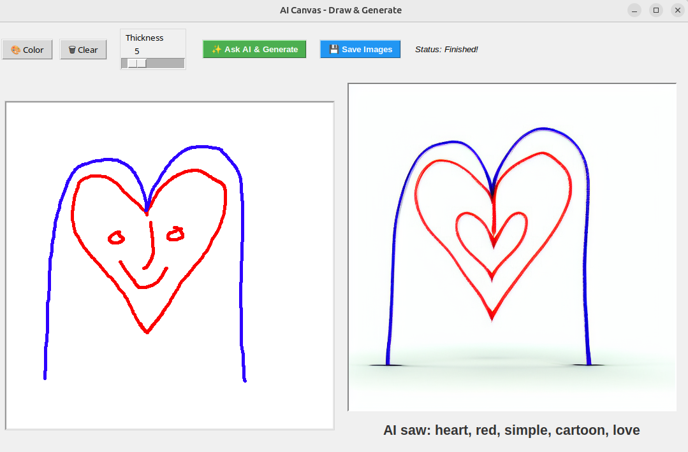
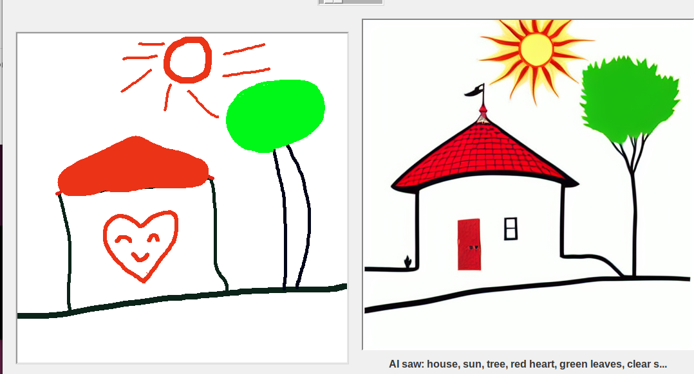
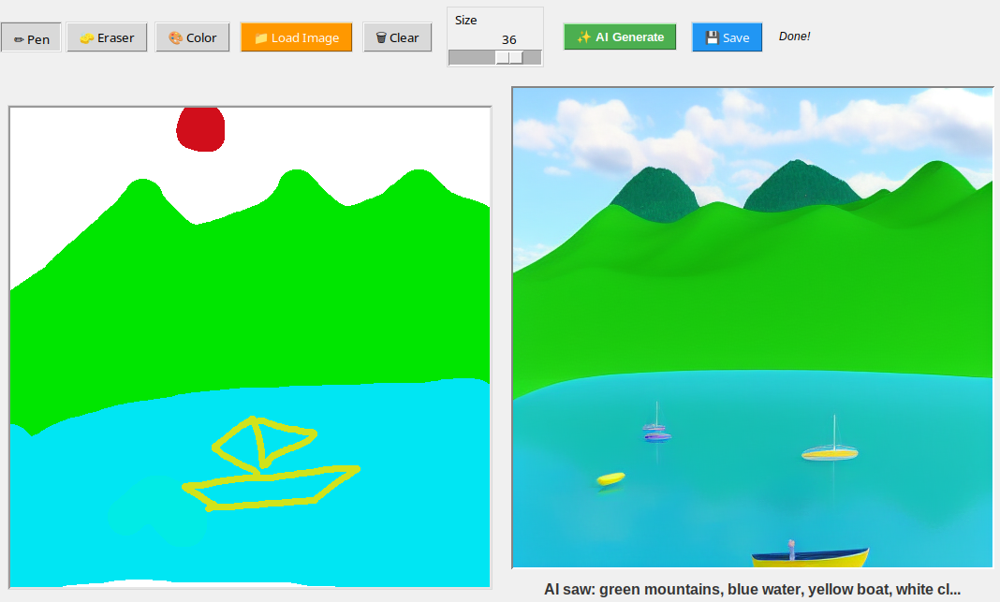
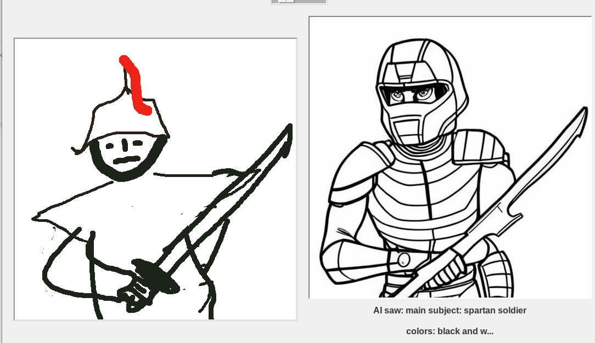
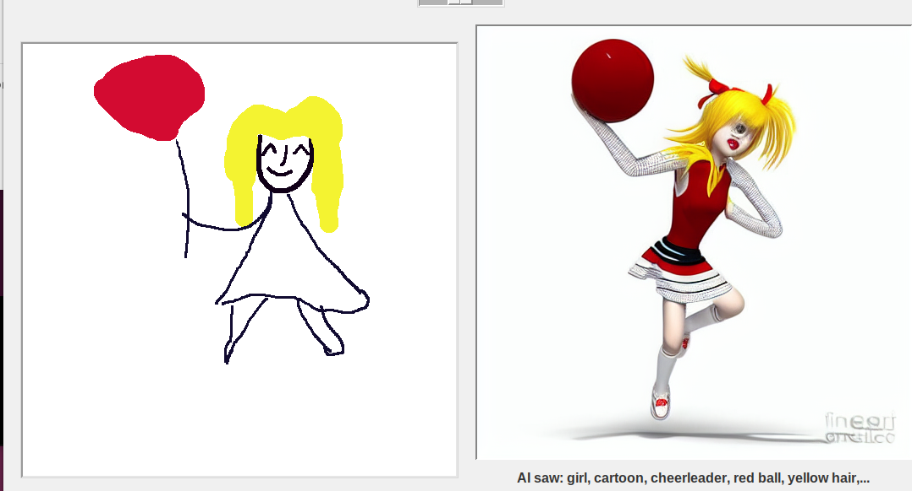

# AI Canvas - Local Draw & Generate

A simple, 100% offline Python Tkinter whiteboard application designed to test how local vision-language models (VLMs) and image diffusion models "talk" to each other. 

By passing custom doodles first to a local vision model to generate a descriptive tag prompt, and then passing both the doodle and those tags to an image-to-image diffusion pipeline, this project explores the "transparency" and semantic limits of local AI systems.

---

## 🎨 How It Works (The "AI Telephone" Experiment)

This project runs a local pipeline that behaves like a game of Pictionary or Telephone:
1. **The User Draws:** You sketch a simple drawing on the whiteboard or load an existing image.
2. **The VLM "Sees" (Ollama/LLaVA):** LLaVA acts as the "eyes". It inspects your drawing and outputs a concise list of comma-separated tags describing the subject, colors, and emotional mood of the scene.
3. **The Painter (Stable Diffusion 1.5):** We feed both your original sketch and LLaVA's tags into an Image-to-Image pipeline (`strength=0.55` to `0.75`). SD uses the structural layout of your drawing as a guide to paint a high-fidelity image inspired by the visual cues.

---

## 🔍 Gallery & AI "Translation" Failures

By using a two-stage local pipeline, we can see exactly where the semantic chain breaks. Here are a few notable experiments found in the `/results` folder:

### 1. The Facial Heart (`results/heart.PNG`)
* **Doodle:** A red heart with a smiley face, draped in a blue outline.
* **AI Interpretation:** `heart, red, simple, cartoon, love`
* **The Failure:** While LLaVA successfully captured the overall heart shape and red theme, it completely ignored the face details inside. Consequently, Stable Diffusion generated a highly clean, abstract heart-within-a-heart, leaving out the facial features entirely.

### 2. Heart’s House (`results/heart_house.PNG`)
* **Doodle:** A house with a red roof and a big heart on the wall, alongside a green tree and a red sun.
* **AI Interpretation:** `house, sun, tree, red heart, green leaves, clear s...`
* **The Failure:** The sun, house shape, and tree translated beautifully. However, the heart *on the wall* of the house was omitted in the rendering, as the model struggled with the spatial hierarchy of placing one subject inside another.

### 3. Mountain & Sea (`results/moutain_sea.png`)
* **Doodle:** Green mountains with a red sun over blue water, containing a simple yellow boat sketch.
* **AI Interpretation:** `green mountains, blue water, yellow boat, white cl...`
* **The Success:** This landscape translated highly successfully! By mapping the simple color fields (green top, blue bottom), the model cleanly separated the mountain range from the water, converting the crude yellow lines into stylized sailing vessels.

### 4. Spartan Warrior (`results/soldier.PNG`)
* **Doodle:** A stick-figure soldier wearing a helmet with a red plume, holding a sword.
* **AI Interpretation:** `main subject: spartan soldier, colors: black and w...`
* **The Failure:** LLaVA understood the general theme but misclassified the weapon's details. As a result, Stable Diffusion rendered the sword as a highly stylized futuristic armor blade, diverging from the traditional look sketched.

### 5. Girl with the Balloon (`results/girl_baloon.PNG`)
* **Doodle:** A stick figure of a girl with yellow hair holding a string attached to a red balloon.
* **AI Interpretation:** `girl, cartoon, cheerleader, red ball, yellow hair,...`
* **The Failure (Classic semantic shift):** Because the balloon was drawn somewhat roundly, LLaVA hallucinated it as a "red ball" and labeled the girl a "cheerleader". Because of this one-word translation shift, Stable Diffusion drew a cheerleader dynamically holding a heavy red bowling-ball-like sphere instead of a balloon.

---

## 🛠️ Reproduction Steps (Ubuntu Setup)

Follow these steps to set up and run this application locally on an Ubuntu machine. 

> **Note on Virtual Environments:** The `ai_draw_env` directory is ignored in this repository. Virtual environments are system-dependent and cannot be directly shared across platforms, so you must create a fresh one locally using the steps below.

### 1. Install System Dependencies
Make sure Python, `venv`, pip, and Tkinter (the window UI library) are installed on your machine:

    sudo apt update
    sudo apt install python3-pip python3-venv python3-tk curl -y

### 2. Install System Dependencies

We use Ollama to run the LLaVA vision model locally.

Install Ollama

    curl -fsSL https://ollama.com/install.sh | sh

Pull the LLaVA model (requires ~4.7GB space)

    ollama pull llava
    
Please ensure the Ollama service is running in the background. If you installed via the official script, it should run automatically via systemd.

### 3. Clone and Set Up the Python Environment

Navigate to your project folder, create a virtual environment, and cd to it:

    cd image_to_image_model
    
Create your virtual environment (only one time)

   python3 -m venv ai_draw_env
   
Activate the virtual environment in your terminal:

   source ai_draw_env/bin/activate
   
### 4. Install Python Packages

    pip install torch diffusers transformers accelerate pillow      ollama
   
Then you can run the app:

    python3 ai_paint.py
